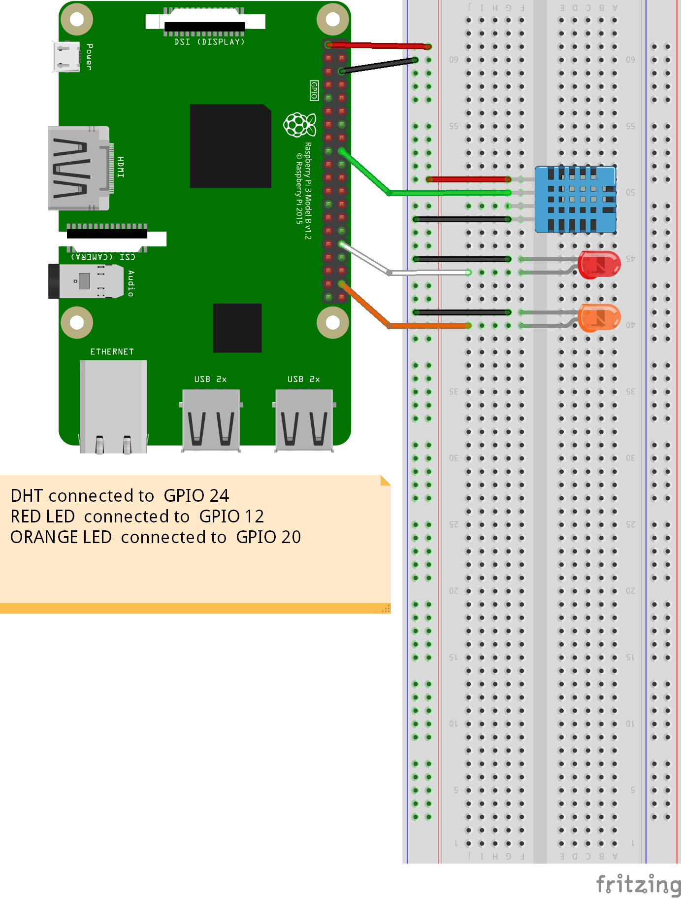

## Working with Flask web server on Raspberry Pi

Progress of the tutorials

- [X] Sensor Schematics
- [x] Turn on/off Led
- [ ] Read from temprature and humidity from dht
- [ ] Setting up flask environment
- [ ] Setting up flask basic project structure
- [ ] Set up flask route to turn on/off Led
- [ ] Set up flask route to display data from the DHT
- [ ] Control light and read temprature from web browser

<br>
<hr>

### Project Requirements

#### Hardware Requirements

- Raspberry Pi
- 2 LED
- DHT sensor
- Connecting Wires
- Breadboard

#### Software Requirements

- Raspberry Pi OS Desktop
- python3
- flask

<hr>
<br>

### Project schematics

Connect the DHT sensor and 2 LED as displayed below:



### Login to the pi

1. ssh to the pi

```bash
ssh <raspberry-pi-address>
```

2. create a folder with the name `flaskapp` and move into the directory

```bash
mkdir flaskapp
cd flaskapp
 ```

3. create a file led.py edit using nano editor or your favorite ide/text editor

```bash
touch led.py
sudo nano
```
4. Copy the code below to led.py.Once done editing save the file.

```python
## gpiozero is a library that is used to read and write the Raspberry pi GPIOs
#we use the sleep function in the time module to pause the program in a defined time
from gpiozero import LED
from time import sleep

#LED function takes the GPIO pin number as a paramenter.
led = LED(12)

while True:# This is an infinite loop
    led.on() #led at gpio pin 12 is turn on
    sleep(1)
    led.off() #led at gpio pin 12 is turn off
    sleep(1)
```

5. Run the file and observe the led connected at gpio 12

```bash
python3 led.py
```
